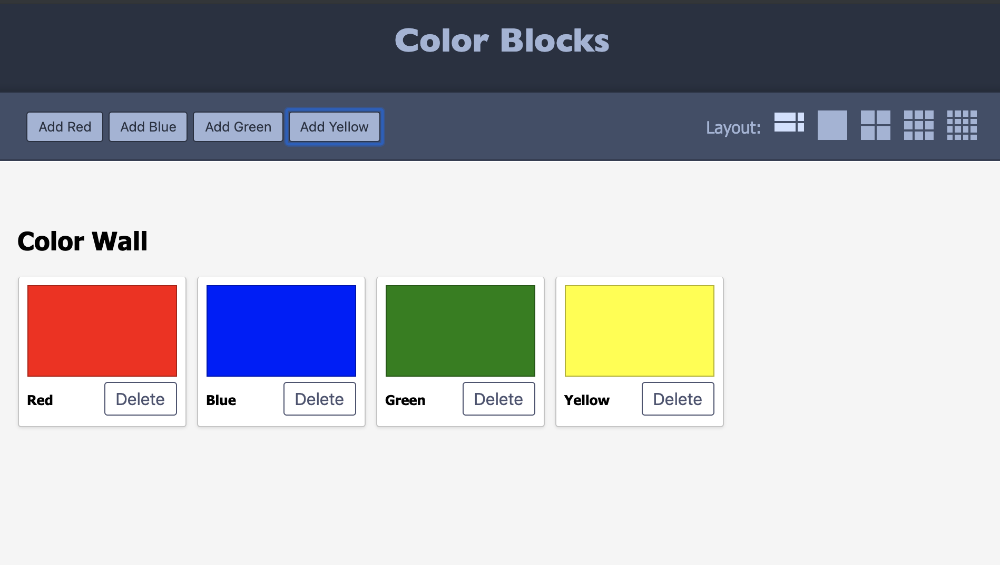

# Advanced Color Blocks Exercise

## Description

This is a client-side exercise to practice conditional rendering and layout. The UI allows a way to manage color swatches for a user. There is a server already built out with all the endpoints needed for the UI interactions. A screenshot is shown below demoing an example of the finished application. There is no mandate to use Material-UI or Bootstrap with this exercise. Have fun with this and use any style library or custom CSS you want in order to create the application.

### Screen Shot



## Prerequisites

The following software is required to run this application.

1. [Node.js](https://nodejs.org/en/)

## Getting Started

Create a new repo for this exercise. Click on the green **Code** button and select the **Download ZIP** option from the dropdown. Then unpack the ZIP file and move the project folder to an appropriate location on the local machine. Don't forget to initialize your git repo and attach it to a GitHub repo.

### Create Database

1. from the terminal run: `createdb colour_palette`
1. use the queries provided in `/database/init.sql` to generate all of the tables needed
1. use the queries provided in `/database/data.sql` to add data to the tables

### Spin Up the Project

1. from project directory in the terminal
1. run: `npm install`
1. run: `npm run server`
    1. *runs the server application at http://localhost:5000*
1. open a separate terminal in the same project directory
1. run: `npm run client`
    1. *runs the server application at http://localhost:3000*

## Application Requirements

**Server Endpoints:**

- **Get All Available Colours**
    - method: GET
    - `/api/colours/available`
- **Save Available Colour**
    - method: POST
    - `/api/colours/available`
    - body:
    ```
    {
        "name": "orange",
        "hexcode": "#F57200"
    }
    ```
- **Update Available Colour**
    - method: PUT
    - `/api/colours/available/:id`
    - body:
    ```
    {
        "name": "orange",
        "hexcode": "#F57200"
    }
    ```
- **Delete Available Colour**
    - method: DELETE
    - `/api/colours/available/:id`
- **Get All Palette Colours**
    - method: GET
    - `/api/palette/`
- **Save Palette Colour**
    - method: POST
    - `/api/palette/`
    - body:
    ```
    {
      colour_id: number
    }
    ```
- **Delete palette Colour**
    - method: DELETE
    - `/api/palette//:id`

### Adding Colors

1. In the `Header` should be a series of "Add Color" buttons that represent all of the available colors in the `available_colours` table.
    - Information for each "Add Color" button can be retrieved by using the **Get All Available Colours** endpoint (`/api/colours/available`)
1. Each color that comes back from the server should be rendered as an "Add Color" button
    - clicking an "Add Color" button adds the color that was clicked as a new entry into the `my_palette` table using the **Save Palette Colour** endpoint (`/api/palette/`)
1. At the end of the list of buttons should be a **Create New Color** button
    - clicking the **Create New Color** button will open a modal with a **Color Name** input, a **Color Hexcode** input, and a **Save Color** button
    - clicking the **Save Color** button in the modal will save a new color to the `available_colours` table using the **Save Available Colour** endpoint (`/api/colours/available`)

### Layout Requirements

1. In the lower right of the `Header` should be a series of 5 layout icons with a **Layout** label. 
    - clicking on any of the icons will alter the layout of the *Color Blocks* displayed in the palette area of the application. From left to right the icons are; auto, 1 across, 2 across, 3 across, & 4 across.
1. The 5 layout icons starting from the left are **Auto**, **1 Across**, **2 Across**, **3 Across**, & **4 Across**
    - **Auto**, default layout that will cause the *Color Blocks* to inherit their default size
    - **1 Across**, when selected (clicked) this layout option will cause a single *Color Block* to fill up the entire available width of the application
    - **2 Across**, when selected (clicked) this layout option will cause the *Color Block* to be 50% of the available application width showing only 2 *Color Blocks* in a single row
    - **3 Across**, when selected (clicked) this layout option will cause the *Color Block* to be 50% of the available application width showing only 3 *Color Blocks* in a single row
    - **4 Across**, when selected (clicked) this layout option will cause the *Color Block* to be 50% of the available application width showing only 4 *Color Blocks* in a single row

### Palette Requirements

1. In the palette section of the application a *Color Block* will be displayed for each color item int the data coming back from the **Get All Palette Colours** endpoint (`/api/palette`)
1. Each *Color Block* consists of three parts; a color swatch, a label with the name of the color, and a **Delete** button
    - clicking the **Delete** button on an individual *Color Block* should make a call to the **Delete palette Colour** endpoint (`/api/palette/:id`)
    - after the **DELETE** call to the endpoint update the palette content by making a call to the **Get All Palette Colours** endpoint (`/api/palette`)

## Stretch Goals

1. Add the ability to update an existing "Add Color" button option
1. Add an "Edit" button to the *Color Blocks* that flips over the card
    - on the back side of the card a single dropdown and a "Save" button
    - dropdown will show all of the available color options and allow the selection of a different color
    - when clicking the "Save" button an update will be sent to the server in order to update the specific palette item
1. Add the ability to have different users so they can save their own color palettes
    - creation of login Authentication and Authorization
    - this will mean both server and database updates
